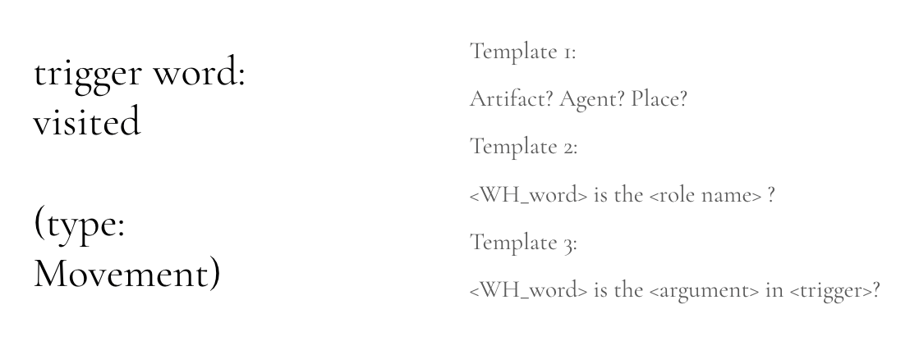
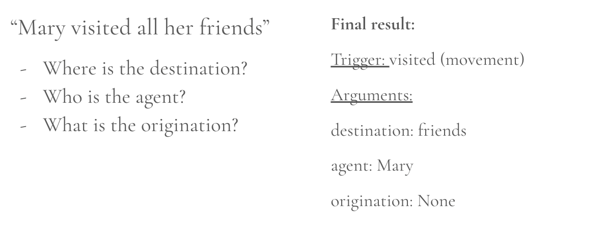
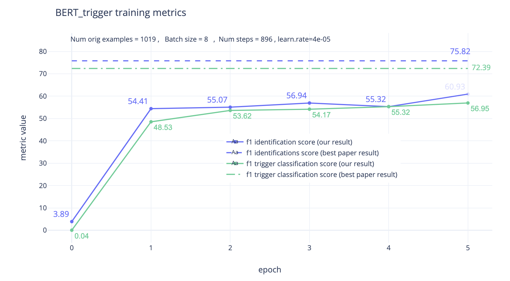
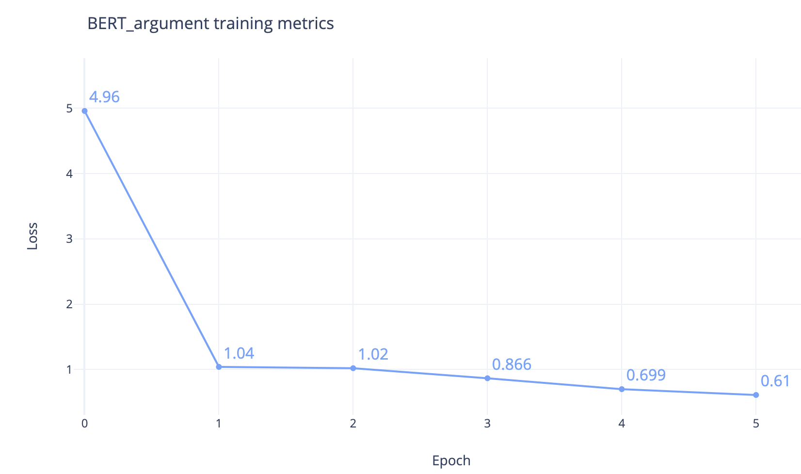

# Event extraction using transformers

## FOLDER STRUCTURE 

```
├── README.md
├── src                    # folder of 2 versions: 
│   ├── BERT (scratch)          # Experimental implementation from scratch with no ACE pretraining
│   ├── BERT (paper)            # Implementation from "Event Extraction by Answering (Almost) Natural Questions"
│       └── args_qa_thresh_output                # Logs from running argument extraction
│       └── trigger_qa_output                    # Logs from runnign trigger extraction
│       └── code                                 # Scripts for running trigger and argument extraction
|       └── data                                 # Raw and processed data should go here
|       └── proc                                 # Scripts for data preprocessing
|       └── question templates                   # .csv files of tempaltes for argument extractions
└── figures                #figures used in README

```

## TASK
Imagine having a thousands articles about what happened on stock market on a given day - and only 1 hour to analyze them. This is not a completely unrealistic situation. In fact, many research groups currently work on a so-called "event extraction" task. Usual event extraction requirements include:
1. Detecting the event type by identifying main trigger (What happened? What type of event is this?)
2. Extracting its corresponding arguments (Where did it happen? When? Who is the main agent?)

There is a great variety of existing solutions. However, they all rely too heavily on entity information for argument extraction (we need to identify entities, their semantics, use parsers or trained models...); they also do not exploit context and, as a result, do not recognize similarities of related argument roles across event types. One architecture that is able to address these issues and exploit context heavily is ***BERT*** or ***Bidirectional Encoder Representations from Transformers***


## BERT
BERT is a transformer, meaning it incorporates a concept of attention into encoder-decoder architecture. Attention units within BERT produce an embedding for every token in a sentence including other relevant tokens weighted by attention.

BERT has been pretrained on ***Masked Language Modeling*** and ***Next Sentence Prediction***.  
- In ***masked language modeling*** instead of predicting every next token, a percentage of input tokens is masked at random and only those masked tokens are predicted.
- ***Next sentence prediction task*** is a binary classification task in which, given a pair of sentences, we predict if the input sentence is the actual next sentence after the current one. 

With this pretraining, BERT can be fine-tuned for different purposes; The first BERT we use in current tutorial (BERT Trigger) outputs type, while second (BERT Argument) one gives offsets of answers. Both used pretrained pytorch module.


For both of these architectures, if the question is formulated properly, we might be able to use it for detecting a trigger event and then collecting its accompanying descriptors.  There are numerous benefits to this approach, namely:

1. No entity recognition is required
2. Ability to work with context of the sentence allows us to transfer knowledge of extracted arguments across semantically related roles
3. It works in a zero-shot setting

How does preparation for BERT looks like?
As with any language model, we can not simply feed text into the network. While other networks use embeddings like Word2Vec or Glove, BERT has its own pretrained tokenizer. Lets see how it works on a small example:

            ! pip install transformers
            from transformers import BertTokenizer

            tokenizer = BertTokenizer.from_pretrained('bert-base-uncased', 
            													do_lower_case=True)
            tokenizer.encode('TSLA to drop 6.4% last week after missing Q4 earnings')
            

We get an output:

            python
            [101,
            24529,2721,2000,4530,1020,1012,1018,1003,2197,2733,2044,4394,1053,2549,16565,
            102]
            

Where 101 and 102 are tokens indicating start and end of input.

However, this transformation is not enough.  BERT normally expects inputs in the format **[CLS] sentence [SEP] -** and that is exactly what happens in read_ace_examples(...) (ACE is the dataset we use for training and testing; but more on this later). 

There is, however, more to it. Because we want to encode both a question and a sentence together, our format is:


And these tokens should be added before passing sentence to the BERT tokenizer. It is important to note here that N is normally fixed. Any sequence that is smaller in size should be padded with [PAD] token before passing to the model. Another requirement is an input mask.  It is used to distinguish between two parts of the text: question (masked with 0's) and reference text (masked with 1's). 
A few other important variables used:

segment_ids - help distinguish sentences in multi sentence tasks
attention_mask - used to explicitly state which tokens are real words and which are padding ([PAD])

## DATASET
The type of the task we are working with requires a very specific type of dataset that has events and event’s argument extracted. One of such datasets is ACE, or Automatic Content Extraction. It has almost 600 annotated documents, each containing multiple sentences.  Each sentence has entities annotated (PER, ORG, GPE, LOC, FAC, VEH, WEA), as well as their subtypes and events:
```
<entity_mention ID="AFP_ENG_20030330.0211-E3-1" TYPE="NOM" LDCTYPE="NOM" LDCATR="FALSE">
  <extent>
    <charseq START="134" END="170">Some 2,500 mainly university students</charseq>
  </extent>
  <head>
    <charseq START="163" END="170">students</charseq>
  </head>
</entity_mention>
```
There are papers and big seminal works written on the processing of ACE dataset, all of them differ from each other. We used a preprocessing script adapted from https://github.com/dwadden/dygiepp . This script works with old version of spacy and will break if we won't create a virtual environment. So to parse your data:
```
conda deactivate
conda create --name ace-event-preprocess python=3.7
conda activate ace-event-preprocess
pip install -r scripts/data/ace-event/requirements.txt
python -m spacy download en
```

After you activate the environment, you can start parsing. If you run further trainings on your own computer and do not have access to big computational resources, we recommend reducing the number of files you have for training and testing by erasing their names in ./proc/scripts/data/ace-event/event-split/[fold].filelist . Make sure you save the proportionality (at least ~80% files for training). After that, collect relevant ACE data and parse it:
```
bash ./scripts/data/ace-event/collect_ace_event.sh [path-to-ACE-data]
python ./scripts/data/ace-event/parse_ace_event.py default-settings
```

The result is split into train, test and dev json files. In each of this files, there are multiline json objects. However, json.loads() expects 1 json object to take 1 line. So we want to run additional script that reformats our result:
```
python scripts/data/ace-event/convert_examples.py
```

## PIPELINE, RUNNING CODE

As we already saw, BERT might have a great potential for event extraction. We followed a procedure outlined in paper "Event Extraction by Answering (Almost) Natural Questions":

1. Given text, instantiate trigger detection questions to ask
2. Pass questions and text to BERT_QA_Trigger that will be able to detect the trigger that caused the event

Surprisingly enough, we do not need to come up with complex questions to extract triggers. Authors of the paper propose simple "trigger" and "what is the trigger?" questions. 

Before we run the script and understand how the trigger type prediction works, lets prepare the dataset using the conventions we discussed in "BERT" section. The preprocessing happens in read_ace_examples function. We open one of the prepared {train/test/dev}_converted.json files where each line is a separate json object. We collect sentence, ground truth events that occured within it, as well as start id of the sentence:  
          
          for line in f:
            example = json.loads(line)
            sentence, events, s_start = example["sentence"], example["event"], example["s_start"]
            offset_category = dict()
            for event in events:
                assert len(event[0]) == 2
                offset, category = event[0][0] - s_start, event[0][1]
                offset_category[offset] = category
When adding a start token, we want to mask it with 0 both in segment ids, sentence mask and put None in labels (since there is no possible class associated with any of the seperators):

            tokens.append("[CLS]")
            segment_ids.append(0)
            in_sentence.append(0)
            labels.append(category_vocab.category_to_index["None"])

After that, we can append trigger questions that would be asked to identify the trigger. You can see that that query is also masked with 0's:
            
            query = candidate_queries[nth_query]
            for (i, token) in enumerate(query):
                sub_tokens = tokenizer.tokenize(token)
                if not sub_tokens:
                    continue
                tokens.append(sub_tokens[0])
                segment_ids.append(0)
                in_sentence.append(0)
                labels.append(category_vocab.category_to_index["None"])

In contrast to query, the sentence that follows in input should be masked with 1's. There is really no difference in whether we use 0 for query or for sentence - it is just a convention followed by programmers when working with BERT:
             
             for (i, token) in enumerate(sentence):
                sub_tokens = tokenizer.tokenize(token)
                if not sub_tokens:
                    continue
                tokens.append(sub_tokens[0])
                segment_ids.append(1)
                in_sentence.append(1)
                if i in offset_category:
                    labels.append(category_vocab.category_to_index[offset_category[i]])
                else:
                    labels.append(category_vocab.category_to_index["None"])

And of course we should not forget about end-of-the-sentence token [SEP]:

            tokens.append("[SEP]")
            segment_ids.append(1)
            in_sentence.append(0)
            labels.append(category_vocab.category_to_index["None"])

After all the preparations, we are good to start the actual training. BERT_QA_Trigger is the module **BertForTokenClassification(config, num_labels)** and it predicts the event type for each token in sentence (or None if it is not an event trigger). A small example of how it does so:

        from src.BERT_paper.code.pytorch_pretrained_bert.modeling import *
        ids = torch.LongTensor([[31, 51, 99], [15, 5, 0]])
        mask = torch.LongTensor([[1, 1, 1], [1, 1, 0]])
        token_type_ids = torch.LongTensor([[0, 0, 1], [0, 1, 0]])
        config = BertConfig(vocab_size_or_config_json_file=32000, hidden_size=768,
                num_hidden_layers=12, num_attention_heads=12, intermediate_size=3072)
        num_labels = 2
        model = BertForTokenClassification(config, num_labels)
        logits = model(ids, token_type_ids, mask)
        
And we get classification logits of shape [batch_size, sequence_length, num_labels]:

        tensor([[[ 0.8151, -0.4177],
                 [-0.0215,  0.4177],
                 [ 0.2697,  0.3654]],

                [[-0.0279,  0.3600],
                 [ 0.1775,  0.0546],
                 [-0.6751, -0.1717]]], grad_fn=<AddBackward0>)
     

But there are not probabilities! We have a minus sign there! Yes. Logits can now be used for further classification, as an input to the softmax function. The softmax function would give us a vector of normalized probabilities (one per class). Because we have identified types for events in ACE, we can also train the BERT for trigger prediction. In run_trigger_qa.py file, we preload the pytorch BERT:

            model = BertForQuestionAnswering.from_pretrained(args.model, cache_dir=PYTORCH_PRETRAINED_BERT_CACHE)
            
You might be curious as to why we do not train it from scratch. Large BERT (the one we are using) has 345 million. Its pretraining took days with several TPUs. So it is easier for us to utilize transfer learning and just fine-tune the model that was pretrained for us. We then iterate through each batch for each epoch, calculating the loss and backpropagating it with pytorch optimizer (can be both initialized to Adam and SGD):

            for epoch in range(int(args.num_train_epochs)):
                model.train()
                
                for step, batch in enumerate(train_batches):
                    input_ids, segment_ids, input_mask, labels = batch
                    loss = model(input_ids, token_type_ids = segment_ids, attention_mask = input_mask, labels = labels)
                    if args.gradient_accumulation_steps > 1:
                        loss = loss / args.gradient_accumulation_steps

                    tr_loss += loss.item()
                    nb_tr_examples += input_ids.size(0)
                    nb_tr_steps += 1

                    optimizer.backward(loss)

To run the full pipeline, we call trigger detection script in script_trigger_qa.sh

What we need: reference text, query question (taken from templates)
What we get: single token of event trigger, its type (one from the set of predefined types)

    bash .src/BERT_paper/code/script_trigger_qa.sh


3. Extracted trigger allows us to identify the type of event and fill in templates for argument extraction


So once we have normalized probabilities per each class, we pick the most probable one. There are a number of classes mentioned in the paper:

    - Business
    - Conflict
    - Contact 
    - Justice
    - Life
    - Movement
    - Personnel
    - Transaction

Given the type, we fill in the template. To make model transferrable between different domains we want to make questions (and their templates) as general as possible. Paper proposes to split them into 3 big groups:

    Template 1: <Role name>
    Template 2: <WH_word> is the <role name> ?
    Template 3: <WH_word> is the <argument> in <trigger>?

There are two files important for template instantiation 

            ARG_QUERY_FILE= './question_templates/arg_queries.csv'
            DES_QUERY_FILE= './question_templates/description_queries.csv'
            
If you open them, you can see that each type of event has also argument subtypes, each with its own question. For example, for event of type Business, there are subtypes Declare-Bankruptcy, End-Org ,Merge-Org ,Start-Org, all having arguments like agent or organization or place: 

            Business.Declare-Bankruptcy_Org,What is the Org?
            Business.Declare-Bankruptcy_Place,Where it takes place?
            Business.End-Org_Place,Where the event takes place?
            Business.End-Org_Org,What is the Org?
            Business.Merge-Org_Org,What is the Org?
            Business.Start-Org_Org,What is the Org?
            Business.Start-Org_Place,Where the event takes place?
            Business.Start-Org_Agent,Who is the agent?

Arg_query contains queries for template 2, while description_queries has queries for template 3 (which are more detailed). We pass them to our function for reading queries. If you end up applying BERT for event extraction in the area that is not mentioned in the templates, you can always use generalized template groups to create your own questions! 
            
            read_query_templates(normal_file = ARG_QUERY_FILE , des_file = DES_QUERY_FILE)
 
We process each type of event, line by line, seperating classes and arguments of interest:

                with open(normal_file, "r", encoding='utf-8') as f:
                    for line in f:
                        event_arg, query = line.strip().split(",")
                        event_type, arg_name = event_arg.split("_")
                        
 For convenience, our templates will be stored as dictionary of dictionaries of lists. We map them in a following way: event_type (ex: Declare-Bankruptcy) -> argument_name (ex: Org) -> [list of instantiated questions]:

            if event_type not in query_templates:
                query_templates[event_type] = dict()
            if arg_name not in query_templates[event_type]:
                query_templates[event_type][arg_name] = list()
Template 0 (just argument name):

            query_templates[event_type][arg_name].append(arg_name)

Template 1 (arg_name + in trigger) (

            query_templates[event_type][arg_name].append(arg_name + " in [trigger]")
            
Template 2 (argument query)

            query_templates[event_type][arg_name].append(query)
            
Template 3 (arg_query + trigger) 

            query_templates[event_type][arg_name].append(query[:-1] + " in [trigger]?")
            
We do the same for both files. In the above templates the [trigger] is getting replaced when forming an instance

4. Use template questions to pass them along input text to BERT_Argument and extract arguments of event


Now we tune BERT for its more classic task: question answering. The format stays the same **[CLS] question [SEP] reference text [SEP].** and we can use the same preprocessing discussed for BERT_Trigger.   The training is following the same procedure here as in Trigger Prediction. However there is one important function that is different - evaluate. We first need to switch model from train to evaluation mode:

            model.eval()

All the evaluation should happen in a scope with disabled gradient calculation:

            torch.no_grad():
                        batch_start_logits, batch_end_logits = model(input_ids, segment_ids, input_mask)

The model returns a set of possible start and end tokens (or, more precisely, their logits - that can be converted to probabilities). We need to decide which to include in final results.  The decision is made in make_predictions(...) functions. There are several cases where we can discard argument candidate:

1. if the start or end index outside of the range of possible tokens (it can happen when there isn't a valid answer for question):

            if start_index >= len(feature.tokens) or end_index >= len(feature.tokens):
                        ...
2. when answer includes more characters than in a limit we set for answer:

            if length > end_index - start_index + 1:
                        ...
3. when we have a range that is not valid (start token goes before end token):
            
            end_index < start_index:
                        ...
             
In all the other cases we can instantiate preliminary prediction with wrapper \_PrelimPrediction and append it to the list of candidates:
            
            _PrelimPrediction(start_index=start_index, end_index=end_index,
                                                  start_logit=result.start_logits[start_index], end_logit=result.end_logits[end_index])


## RESULTS

Before we discuss our results, we want to mention that BERT is a model with hundreds of millions parameters and ACE has 600 large documents. The time required for each epoch was increasing exponentially: if the first epoch was taking 15 minutes, the second one would take more than an hour. We reckon that it is likely the case because the error went down significantly at first - and with each next step we had less and less to learn from our data. We ended up using less than a hundred documents. With all these considerations in mind, results still seemed pretty impressive compared to most existing event extraction models.

- Trigger extraction results


- Argument extraction results



## ADAPTATIONS

The code in this repository is partially adapted from:
```
@inproceedings{du2020event,
    title = {Event Extraction by Answering (Almost) Natural Questions},
    author={Du, Xinya and Cardie, Claire},
    booktitle = "Proceedings of the 2020 Conference on Empirical Methods in Natural Language Processing",
    year = "2020",
    publisher = "Association for Computational Linguistics",
}
```
